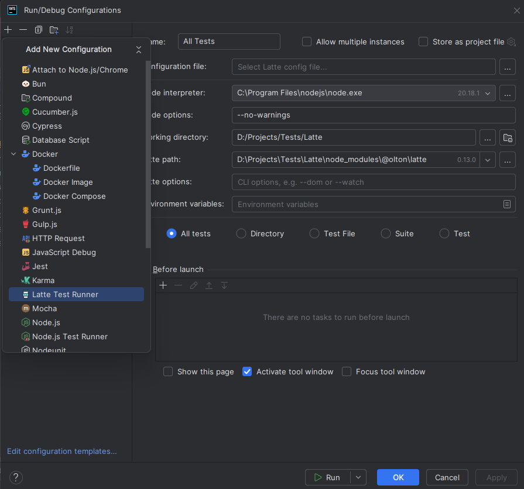
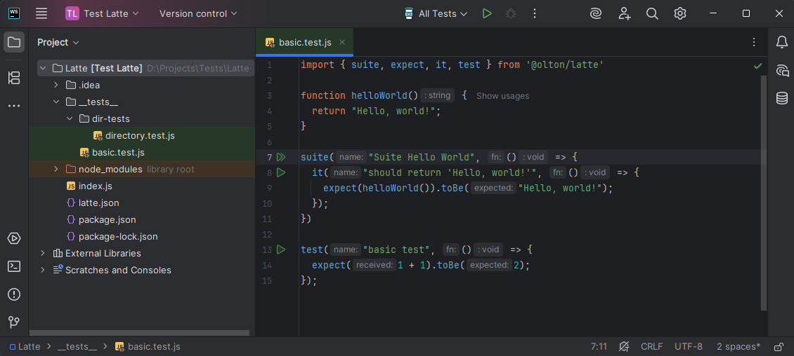

import {Image} from '@astrojs/starlight/components';

Latte provides a plugin for IntelliJ IDEA that allows you to run and debug your tests directly from the IDE.

## Installation

You can install the plugin from the JetBrains Marketplace or from disk.

### From JetBrains Marketplace

1. Open IntelliJ IDEA and go to `File` > `Settings` > `Plugins`
2. Click on the `Marketplace` tab and search for `Latte Test Runner`
3. Click on the `Install` button to install the plugin
4. Restart IntelliJ IDEA to activate the plugin

### From disk

1. Download the plugin from the [GitHub Releases](https://github.com/olton/latte/releases) page
2. Open IntelliJ IDEA and go to `File` > `Settings` > `Plugins`
3. Click on the `Install Plugin from Disk` button
4. Select the downloaded plugin file and click `OK`
5. Restart IntelliJ IDEA to activate the plugin

## Usage

You can run your tests in two ways:

### Run Configuration

1. Open your JavaScript or TypeScript project in IntelliJ IDEA
2. Create a new test file or open an existing one
3. Open the `Run/Debug Configurations` dialog by clicking on the `Run` menu and selecting `Edit Configurations`
4. Click on the `+` button to add a new configuration and select `Latte Test Runner`
5. Fill required fields in the new configuration options dialog.
6. Click `OK` to save the configuration
7. Now you can run your tests by selecting the configuration
8. The test results will be displayed in the `Run` tool window at the bottom of the IDE.

### Run Tests directly from the editor

1. Open your test file in the editor
2. Click on the run button (green triangle, or double triangle for test suite) to the test or test suite you want to run.
3. Run Configuration will be created automatically.
4. The test results will be displayed in the `Run` tool window at the bottom of the IDE.

